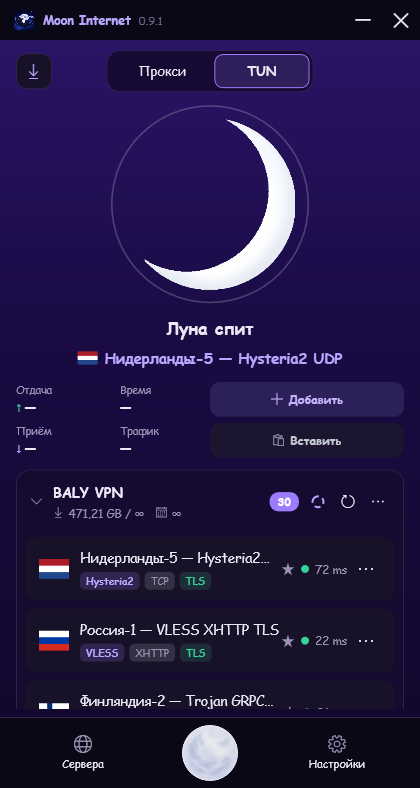
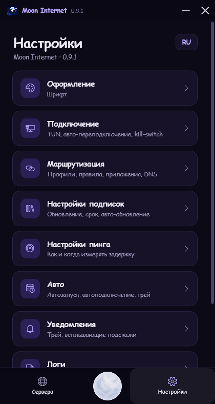
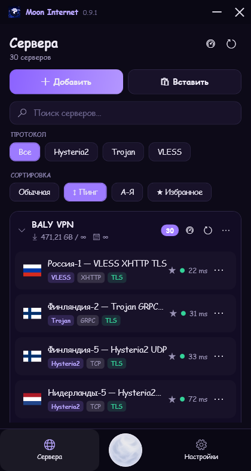
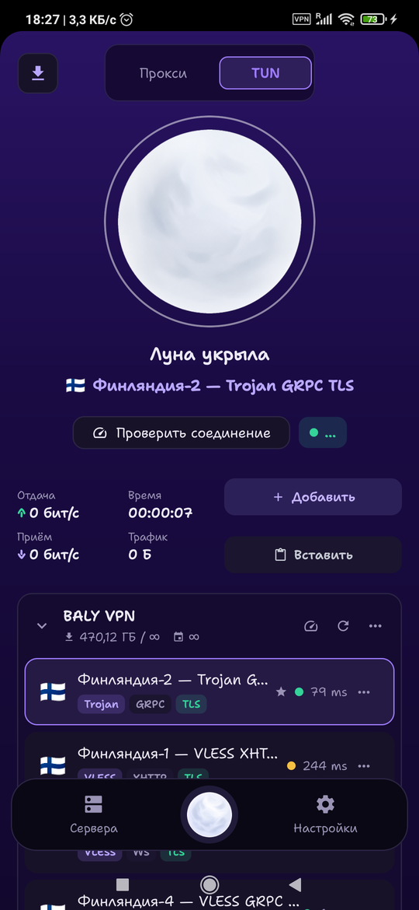
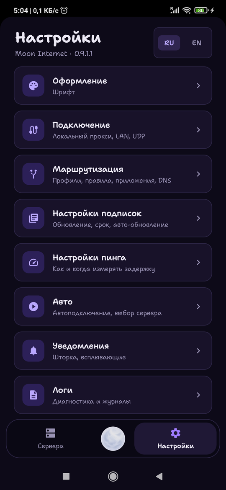
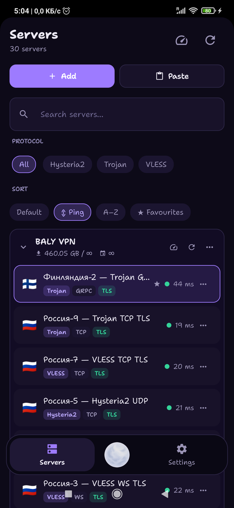

<div align="center">


# Moon Internet

**VPN/прокси-клиент для Windows и Android.**
Ваши подписки, ваши серверы, ваши правила — и ничего, что уходит наружу.

[](../../releases/latest)
[](../../releases)
[](LICENSE)


### [⬇ Скачать](../../releases/latest) · [English](README-EN.md)

</div>

---

<div align="center">

  

  

</div>

---

> **Статус: 0.9.1 beta.** Приложением можно пользоваться каждый день, но шероховатости есть.
> Интерфейс на **русском и английском**, переключается на лету.

| Платформа | Состояние | Что скачивать |
|---|---|---|
| Windows 10/11 x64 | релиз | `MoonInternet-Setup-*.exe` |
| Android 7.0+ (arm64) | бета | `MoonInternet-*.apk` |

---

## Возможности

- **Протоколы** — VLESS (Reality / XHTTP / gRPC / WS / TCP), VMess, Trojan, Shadowsocks, Hysteria2, WireGuard
- **Два режима** — полноценный **TUN**-туннель (через служебный компонент) или **системный прокси** (без прав администратора)
- **Подписки** — автообновление по интервалу самой панели, трафик и срок действия, приветственная шапка, **офлайн-кэш**: серверы видны даже без интернета
- **Маршрутизация** — Direct / Proxy / Block по доменам, IP и тегам `geosite:` / `geoip:`. Импорт из HAPP/INCY или свой профиль с поиском по гео-базе
- **Раздельный туннель** — выбранные приложения мимо VPN (или наоборот, только они через VPN)
- **Действия с сервером** — избранное, пинг, просмотр конфигурации (JSON с подсветкой), копирование ссылки, QR-код
- **Живая статистика** — реальная скорость приёма/отдачи и трафик за сессию, прямо из ядра
- **Трей** — подключение, смена сервера, пинг, сортировка, режим транспорта
- **Обновления** — проверка GitHub при запуске, скачивание и запуск установщика прямо из приложения
- **Уведомления** — подключение, новая версия, конец трафика и срок подписки; всплывать или молча
- **Два языка** — русский и английский, переключатель в настройках
- **Оформление** — темы, цвета кнопок/фона/текста, шрифт, прозрачность окна, свои картинки луны

## Установка (Windows)

Скачайте установщик из [**Releases**](../../releases) и запустите.
Он ставит приложение в `Program Files`, регистрирует служебный компонент для TUN и создаёт ярлыки.

**Больше ничего ставить не нужно** — .NET уже внутри приложения (поэтому установщик и весит ~72 МБ).

> Сборки **не подписаны сертификатом**, поэтому при первом запуске SmartScreen покажет
> предупреждение (*Подробнее → Выполнить в любом случае*). Подробности — в разделе [Безопасность](#безопасность).

## Android

Не «мобильная версия по мотивам», а перенос тех же экранов: те же четыре вкладки,
те же девять страниц настроек, те же отступы. Логика подписок, маршрутизации и генерации
конфигов повторяет десктопную.

- Протоколы: VLESS (Reality / XHTTP / gRPC / WS / TCP), VMess, Trojan, Shadowsocks, Hysteria2
- Туннель через **встроенный TUN-инбаунд xray** — дескриптор от `VpnService` уходит прямо в ядро, без tun2socks
- Режим локального прокси: SOCKS5 + HTTP на устройстве, как в v2rayNG
- Раздельный туннель по приложениям, со списком и иконками
- Сканер QR, плитка в шторке (подключить / пауза / отключить), скорость и трафик в уведомлении
- Пинг всех серверов при открытии — не больше 6 одновременно, чтобы не класть панель провайдера

Ставится APK из [Releases](../../releases). WireGuard и оформление на Android пока не перенесены.

## Сборка из исходников

```powershell
git clone https://github.com/<вы>/moon-internet.git
cd moon-internet

# ядра не лежат в репозитории (~120 МБ сторонних бинарников)
powershell -ExecutionPolicy Bypass -File build\get-cores.ps1

dotnet publish src\MoonInternet.App        -c Release -r win-x64 --self-contained true -o dist\app
dotnet publish src\MoonInternet.TunService -c Release -r win-x64 --self-contained true -o dist\app

# по желанию: собрать установщик (нужен NSIS)
makensis build\installer.nsi
```

Нужно **для сборки**, а не для запуска: **.NET 9 SDK**, Windows 10/11 x64. NSIS — только если хотите собрать ещё и установщик.

### Android

```powershell
# ядро: обёртка xray-core для Android (2dust/AndroidLibXrayLite) — ~19 МБ, в репозиторий не кладём
powershell -ExecutionPolicy Bypass -File android\build-xray.ps1

cd android
.\gradlew assembleRelease
```

Скрипт сам скачает Go, если его нет. Нужны Android SDK + NDK и JDK 17;
путь к инструментам задаётся переменной `MOON_TOOLCHAIN` (по умолчанию `C:\moonbuild`).
Сборка только под **arm64**.

## Архитектура

Moon Internet **не переизобретает протоколы**. На C# написана вся оркестрация — разбор
ссылок и подписок, генерация конфигов, маршрутизация, IPC, работа с TUN, интерфейс,
а сам трафик обрабатывают проверенные ядра. Так же устроены Happ, Nekoray и v2rayN.

```
src/MoonInternet.App          интерфейс WPF (MVVM)
src/MoonInternet.Core         модели, парсеры, генераторы конфигов
src/MoonInternet.Services     менеджер подключения, ядра, подписки, пинг, гео
src/MoonInternet.TunService   служебный компонент (SYSTEM) — TUN-адаптер и маршруты

android/app/.../core          парсеры и генератор конфигов — порт Core
android/app/.../data          подписки, хранилище, гео
android/app/.../vpn           VpnService, xray, плитка в шторке
android/app/.../ui            экраны на Compose — порт XAML
```

Зачем разделение на Windows: полноценный TUN требует создания сетевого адаптера и правки
таблицы маршрутизации, а это невозможно без повышения прав. Служебный компонент работает
как задача от имени SYSTEM, поэтому само приложение остаётся без прав администратора и UAC
не спрашивает разрешение при каждом запуске. Если компонента нет — TUN переключается
на режим системного прокси.

На Android ничего этого не нужно: `VpnService` отдаёт дескриптор туннеля, и он уходит
прямо во встроенный TUN-инбаунд xray.

Ядра: **xray-core** (VLESS/VMess/Trojan/SS + роутер; на Android — он же, через
AndroidLibXrayLite), **sing-box** (TUN, Hysteria2, WireGuard), **tun2socks**
(альтернативный TUN).

## Конфиденциальность

- Никаких аккаунтов, телеметрии, аналитики и обращений «домой».
- Подписки, серверы и ключи хранятся **только на устройстве**: в папке `save\` рядом
  с приложением на Windows, во внутреннем хранилище приложения на Android.
- Приложение обращается ровно к двум типам адресов: **ваши** ссылки-подписки и источники
  гео-правил на GitHub (и только если включена маршрутизация).
- Логи локальные и никуда не отправляются.

## Безопасность

Сборки **не подписаны**, отсюда две вещи:

1. **SmartScreen** предупреждает о неизвестном издателе.
2. **Срабатывания эвристики антивирусов** (пара движков из ~60). Неподписанное .NET-приложение,
   которое несёт в себе VPN-ядра и правит маршруты, для ML-сканеров выглядит подозрительно.
   Если это смущает — соберите из исходников, инструкция выше даёт то же самое приложение.

Служебный компонент слушает **только localhost** (`127.0.0.1:35555`) и принимает лишь свой
небольшой набор команд.

## Сторонние компоненты

Ядра и библиотеки распространяются под своими лицензиями — см. [THIRD-PARTY-NOTICES.md](THIRD-PARTY-NOTICES.md).
sing-box и tun2socks под GPL-3.0 и поставляются **без изменений**.

## Лицензия

[MIT](LICENSE) — на исходный код Moon Internet.

---

*Это приложение — прокси-инструмент. Оно не предоставляет VPN-услуг: серверы вы добавляете
свои. Вы сами отвечаете за то, как его используете, и за соблюдение законов вашей страны.*
